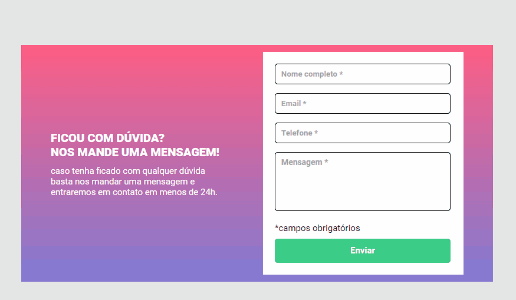

# Formulário com Validação

### Formulário com validação por campo.
[]

## ✨ Sobre o projeto

Essa foi a Quest de HTML + CSS + JS intermediário do curso DevQuest, onde o objetivo é criar um formulário de validação usando JavaScript puro. foi disponibilizado um layout no Figma junto com as orientações de como devia ser a validação.

## 🚀 Aprendizado

Consegui colocar em prática meus conhecimentos em JavaScript para resolver o desafio da melhor forma possível, fiquei bastante feliz com o resultado e vou continuar praticando para alcançar um melhor desempen

## Trcnologias ultilizadas
   
